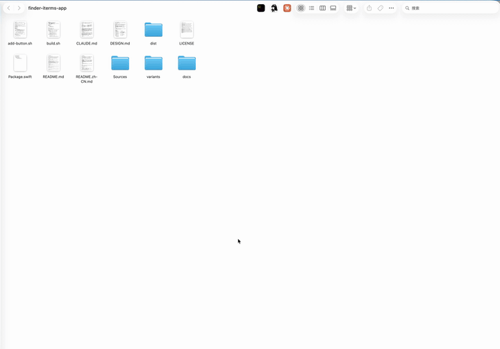
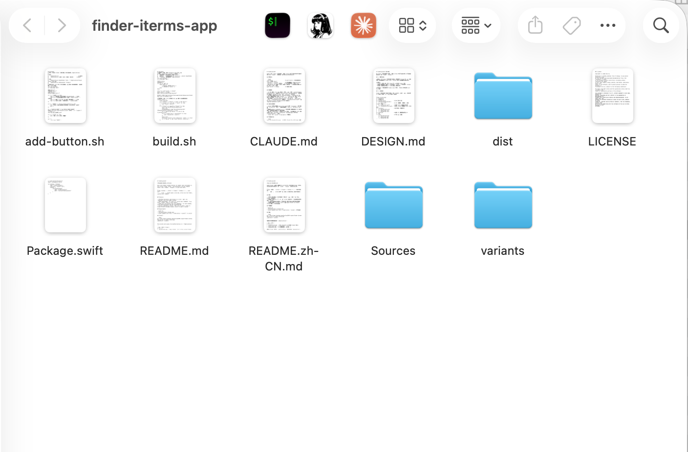

# FinderLauncher

[中文文档](README.zh-CN.md)

One-click Finder toolbar buttons for macOS: open **iTerm2** in the current Finder folder — and optionally run any command there, like `claude`, `lazygit`, or your own tools.



## Features

- **Toolbar-native**: each button is a tiny `.app` you `Cmd+drag` onto the Finder toolbar
- **Run anything**: `cd` only, or `cd && <your command>` (e.g. start `claude` right in that folder)
- **Add your own buttons with one command** — no code changes, icons auto-extracted from any installed app
- **Tiny & dependency-free**: ~150 lines of Swift, talks to Finder/iTerm2 via Apple Events, exits in under a second

## Requirements

- macOS 13+
- [iTerm2](https://iterm2.com)
- Xcode Command Line Tools (`xcode-select --install`) to build
- `jq` (built into macOS 15+; on macOS 13/14 run `brew install jq`)

## Install

```bash
git clone https://github.com/alexliao1985-crypto/finder-iterms-app.git && cd finder-iterms-app
./build.sh --install
```

This builds and copies the bundled buttons to `~/Applications/`:

| App | What it does |
|---|---|
| `OpenIniTerm.app` | Open iTerm2, `cd` to the current Finder folder |
| `OpenClaude.app` | …then run `claude` |
| `OpenClaudeYolo.app` | …then run `claude --dangerously-skip-permissions` |
| `OpenCodexYolo.app` | …then run `codex --dangerously-bypass-approvals-and-sandbox` |
| `OpenHermes.app` | …then run `hermes` |

If a single folder is selected in Finder, the buttons open that folder; otherwise they open the front window's folder.

> [!WARNING]
> `OpenClaudeYolo` starts Claude Code with `--dangerously-skip-permissions`, which skips all permission prompts. Only put it on your toolbar if you want that.
> `OpenCodexYolo` starts Codex with `--dangerously-bypass-approvals-and-sandbox`, which skips approvals and sandbox restrictions. Only put it on your toolbar if you want that.

Then open `~/Applications` in Finder and **hold `Cmd` while dragging** each app onto the Finder toolbar:



On first click, macOS asks for Automation permission (to control Finder and iTerm2) — click **Allow** once for each.

## Add your own button

```bash
./add-button.sh OpenVSCode "code ." "/Applications/Visual Studio Code.app"
./add-button.sh OpenLazygit "lazygit"     # no icon → default iTerm2 icon
./add-button.sh                           # or answer prompts interactively
```

Arguments: `Name` `command` `[icon]` `[display name]`. The command must fit on one line (chain commands with `&&` or `;`). The icon can be an `.icns` file or an `.app` path (its icon is extracted automatically).

To remove a button, delete `variants/<Name>.json` and `~/Applications/<Name>.app`.

## How it works

Each Finder toolbar "button" is just an app. All buttons share one Swift binary; each variant's `Info.plist` carries a `LauncherCommand` field. On click, the app asks Finder (via Apple Events) for the selected folder or the front window's folder, tells iTerm2 to open a new tab (or window) and types `cd '<folder>' && <command>`, then quits. See [DESIGN.md](DESIGN.md) for the full design (in Chinese).

## Troubleshooting

- **"No permission to control Finder/iTerm2" dialog** → System Settings → Privacy & Security → Automation (the dialog has a button that opens it): allow the button app to control Finder and iTerm2.
- **Other errors** are also written to the unified log: `log show --last 5m --predicate 'eventMessage CONTAINS "FinderLauncher"'`.
- **Rebuilt apps ask for permission again** → expected: builds are ad-hoc signed, so the signature changes.

## License

[MIT](LICENSE)
