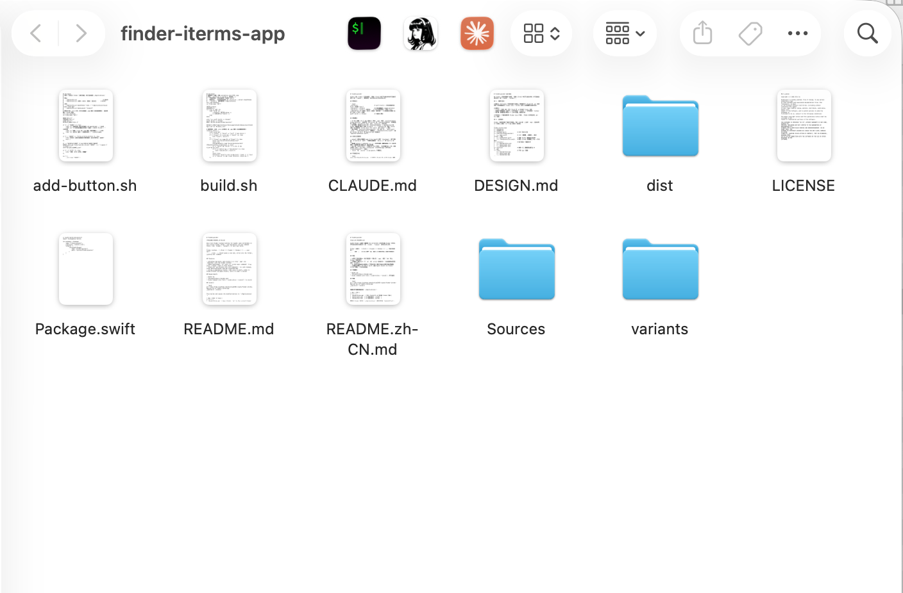

# FinderLauncher

[English](README.md)

macOS Finder 工具栏一键按钮：在 **iTerm2** 中打开当前 Finder 文件夹，并可选自动执行任意命令（如 `claude`、`lazygit` 或你自己的工具）。



点击按钮 → iTerm2 新开 Tab，自动 cd 到该文件夹，并执行你的命令。

## 特性

- **原生工具栏体验**：每个按钮是一个极小的 `.app`，按住 `Cmd` 拖上 Finder 工具栏即可
- **想跑什么跑什么**：只 `cd`，或 `cd && <你的命令>`（比如直接在该目录启动 `claude`）
- **一条命令添加自定义按钮**——不用改代码，图标可自动从任意已装应用提取
- **轻量无依赖**：约 100 行 Swift，通过 Apple Events 与 Finder/iTerm2 通信，1 秒内完成退出

## 环境要求

- macOS 13+
- [iTerm2](https://iterm2.com)
- Xcode Command Line Tools（`xcode-select --install`，用于编译）

## 安装

```bash
git clone https://github.com/alexliao1985-crypto/finder-iterms-app.git && cd finder-iterms-app
./build.sh --install
```

构建并把内置按钮复制到 `~/Applications/`：

| App | 行为 |
|---|---|
| `OpenIniTerm.app` | 打开 iTerm2 并 cd 到当前 Finder 目录 |
| `OpenClaude.app` | cd 后自动执行 `claude` |
| `OpenHermes.app` | cd 后自动执行 `hermes` |

然后在 Finder 中打开 `~/Applications`（前往文件夹 `Cmd+Shift+G`），**按住 `Cmd` 把 app 拖到 Finder 工具栏**。

首次点击时 macOS 会弹"自动化"授权（控制 Finder 和 iTerm2），各点一次"允许"。

## 添加自定义按钮

```bash
./add-button.sh OpenVSCode "code ." "/Applications/Visual Studio Code.app"
./add-button.sh OpenLazygit "lazygit"     # 不给图标则用默认 iTerm2 图标
./add-button.sh                           # 或不带参数，交互式回答
```

参数：`名称` `命令` `[图标]` `[显示名]`。图标可以是 `.icns` 文件，也可以直接给 `.app` 路径（自动提取该应用图标）。

删除按钮：删掉 `variants/<名称>.json` 和 `~/Applications/<名称>.app`。

## 工作原理

Finder 工具栏的每个"按钮"本质是一个 app。所有按钮共享同一个 Swift 二进制，差异只在各自 `Info.plist` 的 `LauncherCommand` 字段。点击时：通过 Apple Events 向 Finder 询问最前窗口目录 → 驱动 iTerm2 新开 Tab（或窗口）→ 输入 `cd '<目录>' && <命令>` → 退出。完整设计见 [DESIGN.md](DESIGN.md)。

## 常见问题

- **点击没反应** → 系统设置 → 隐私与安全性 → 自动化：确认按钮 app 已被允许控制 Finder 和 iTerm2
- **重新构建后又弹授权** → 正常现象：ad-hoc 签名每次构建会变化

## 许可证

[MIT](LICENSE)
